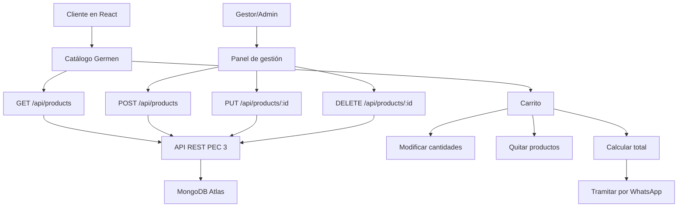

# PEC 4 - Germen Latin Market Frontend

Frontend desarrollado con **React + Vite + Tailwind CSS** para el proyecto **Germen Latin Market**, una tienda online de productos latinos. La aplicación se conecta a la API REST de la PEC 3 para obtener productos reales desde MongoDB Atlas.

## Funcionalidades principales

- Catálogo dinámico de productos mediante `GET /api/products`.
- Buscador funcional por nombre, descripción, categoría, presentación, origen o sabor.
- Filtros por categorías: Despensa, Bebidas, Dulces, Chucherías, Carnes, Embutidos, Cocina y más.
- Carrito de compra con contador visible.
- Gestión del carrito: aumentar cantidad, disminuir cantidad, quitar productos y vaciar carrito.
- Cálculo automático del total a pagar.
- Tramitación del pedido por WhatsApp al número `+90 551 026 99 86`.
- Chatbot de atención al cliente para orientar la compra.
- Panel de gestión visible para usuarios con rol `Gestor` o `Admin`.
- Creación de productos mediante `POST /api/products`.
- Edición y eliminación de productos para usuarios con privilegios.
- Estados de carga, error y éxito.
- Diseño responsive con identidad visual vinotinto, blanco y tonos cálidos.
- Banner principal con imagen promocional propia de Germen Latin Market.

## Roles utilizados

- **Cliente:** puede ver productos, agregar al carrito, cambiar cantidades, quitar productos del carrito y tramitar pedido por WhatsApp.
- **Gestor:** puede crear y editar productos.
- **Admin:** puede crear, editar y eliminar productos.

## Variables de entorno

Crear un archivo `.env` en la raíz del proyecto:

```env
VITE_API_URL=https://pec3-geinomi-api-rest.vercel.app
```

El archivo `.env.example` incluye el modelo de variable requerido.

## Instalación y ejecución

```bash
npm install
npm run dev
```

Abrir en el navegador:

```text
http://localhost:5173
```

## Backend utilizado

La aplicación consume la API REST desarrollada en la PEC 3:

```text
https://pec3-geinomi-api-rest.vercel.app
```

Endpoint principal:

```text
GET /api/products
POST /api/products
PUT /api/products/:id
DELETE /api/products/:id
```

## Estructura del proyecto

```text
src/
├── components/
│   ├── Alert.jsx
│   ├── CartContext.jsx
│   ├── CartDrawer.jsx
│   ├── Chatbot.jsx
│   ├── Footer.jsx
│   ├── Header.jsx
│   ├── Loading.jsx
│   ├── ProductCard.jsx
│   ├── ProductDetail.jsx
│   └── ProductForm.jsx
├── pages/
│   └── Home.jsx
├── services/
│   └── api.js
├── styles/
│   └── global.css
├── App.jsx
└── main.jsx
```

## Diagrama Mermaid




## Carrusel visual

La página principal incluye dos banners promocionales de Germen Latin Market que se alternan automáticamente mientras el usuario visita la tienda. Ambos banners están ubicados en `public/images/` y se muestran desde el componente `Home.jsx`.
