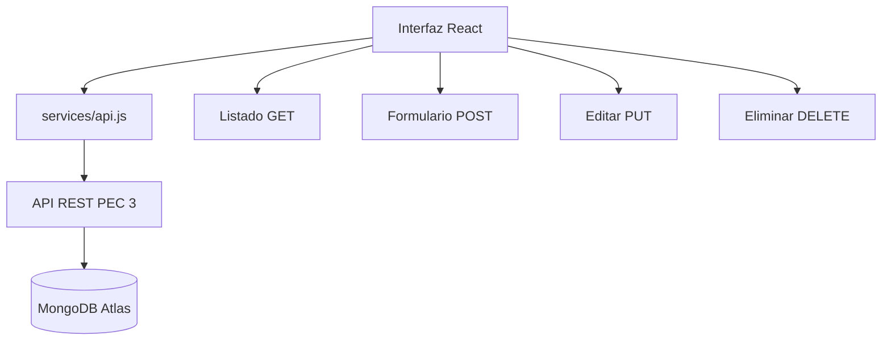

# PEC 4 · Germen Latin Market React Frontend

Frontend en React para **Germen Latin Market**, una tienda online de productos latinos y alimenticios. La aplicación consume la API REST creada en la PEC 3 y obtiene los productos desde MongoDB Atlas a través del backend.

## Funcionalidades

- Listado dinámico de productos con GET.
- Formulario controlado para crear productos con POST.
- Edición y eliminación de productos.
- Búsqueda y filtro por categoría.
- Estados de carga, error y éxito.
- Componentes reutilizables.
- Separación entre componentes, páginas y servicios.

## Estructura

```text
src/
  components/
  pages/
  services/api.js
  styles/global.css
  App.jsx
  main.jsx
public/
  germen-logo.svg
.env.example
```

## Variable de entorno

Crear un archivo `.env` en la raíz del frontend:

```env
VITE_API_URL=https://TU_API_BACKEND.vercel.app
```

Para usar la API ya desplegada de la PEC 3 puedes colocar temporalmente:

```env
VITE_API_URL=https://pec3-geinomi-api-rest.vercel.app
```

El archivo `.env` real no debe subirse a GitHub.

## Instalación y ejecución

```bash
npm install
npm run dev
```

Abrir en el navegador:

```text
http://localhost:5173
```

## Endpoints usados

```text
GET    /api/products
POST   /api/products
PUT    /api/products/:id
DELETE /api/products/:id
```

## Diagrama Mermaid


